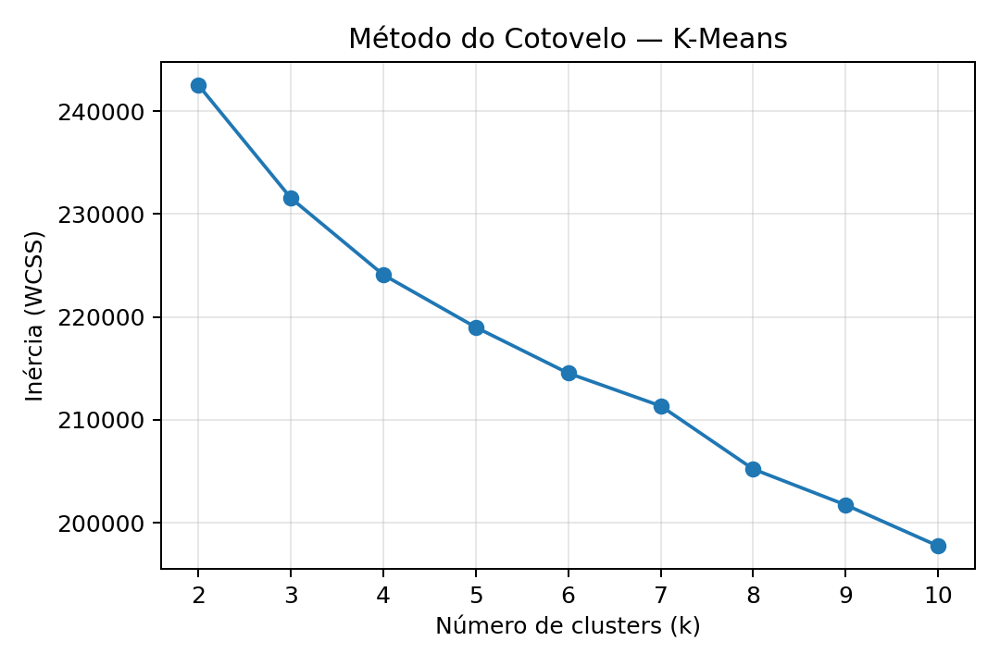

## exploração

O dataset contém 4601 observações, no qual cada linha representa um email, descrito por 58 atributos. Desses, 57 são características extraídas do texto (frequência de palavras, caracteres especiais, uso de maiúsculas, etc.) e 1 é a variável alvo (is_spam), indicando se o email é spam (1) ou não-spam (0).

Como o K-Means é um método não supervisionado, nesta seção usamos somente as features (sem o alvo) para explorar a separabilidade natural dos dados. Ou seja para aplicar o algoritmo de agrupamento K-Means, não utilizamos o alvo (is_spam), pois o objetivo é agrupar automaticamente os dados em clusters com base em suas características.

Escolha do número de clusters (k)

Método do elbow (WCSS)

## Definição do Número de Clusters

Uma etapa crítica no K-Means é escolher o valor de k (número de clusters). Para isso, avaliamos:

Método elbow(WCSS)

O gráfico de inércia (WCSS) em função de k ajuda a identificar um ponto de “cotovelo”, onde a redução de WCSS passa a ser marginal. Para este conjunto, k = 2 é um candidato natural (compatível com spam vs. não-spam), embora valores maiores também possam capturar subgrupos com padrões semelhantes.

Coeficiente de Silhouette

O coeficiente de Silhouette mede, de −1 a 1, o quão coesos e separados estão os clusters. Valores mais altos indicam melhor separação intrínseca. Usamos este gráfico para confirmar a escolha de k observada no cotovelo.

visto isso, utilizamos os seguinte clusters:

char_freq_! (uso do caractere "!")

word_freq_free (uso da palavra "free")

O gráfico abaixo mostra os dois clusters encontrados pelo K-Means, com seus respectivos centróides (estrelas vermelhas):

Emails com maior frequência de "!" e "free" tendem a ser agrupados no cluster associado a spam. Já Emails com baixa frequência desses elementos ficam concentrados no cluster de não-spam.

## Conclusão

O modelo de K-Means aplicado ao dataset Spambase mostrou-se uma ferramenta útil para a exploração e identificação de padrões nos emails. As features, ou seja, as variáveis que descrevem cada mensagem, como a frequência da palavra “free” e o uso do caractere “!”, tiveram papel fundamental na formação dos clusters, os grupos criados automaticamente pelo algoritmo. Observou-se que os emails com maior presença desses elementos tendem a ser agrupados em um cluster associado ao spam, enquanto aqueles com baixa frequência permanecem no grupo de não-spam. Embora o K-Means não atinja o mesmo desempenho de modelos supervisionados, como a Árvore de Decisão ou o KNN, ele alcançou uma separação satisfatória das classes, evidenciando que as características linguísticas e de formatação são fortes indicadores de spam. Essa abordagem reforça o valor do K-Means como técnica exploratória, capaz de revelar padrões ocultos nos dados e oferecer uma visão inicial relevante, mesmo sem utilizar a variável alvo.

