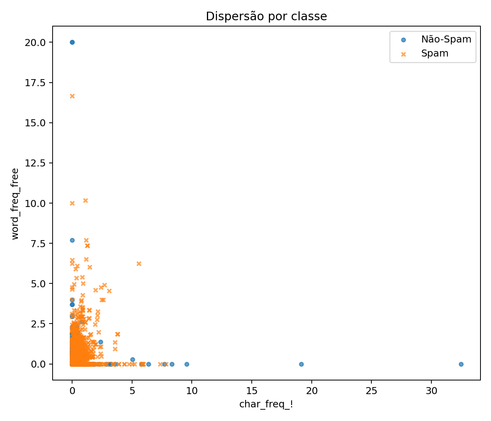
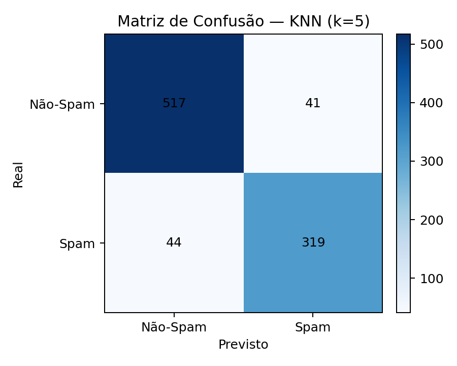
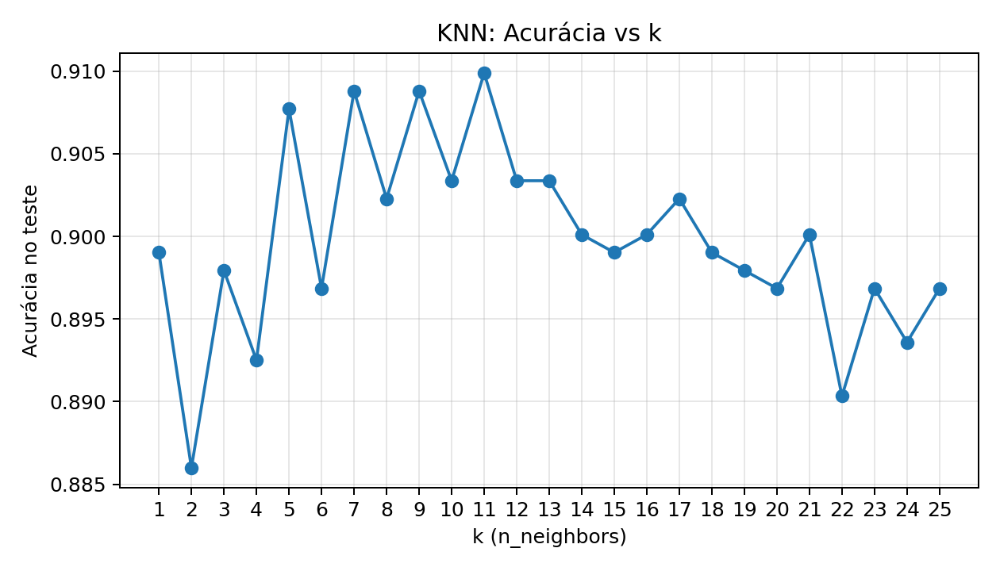
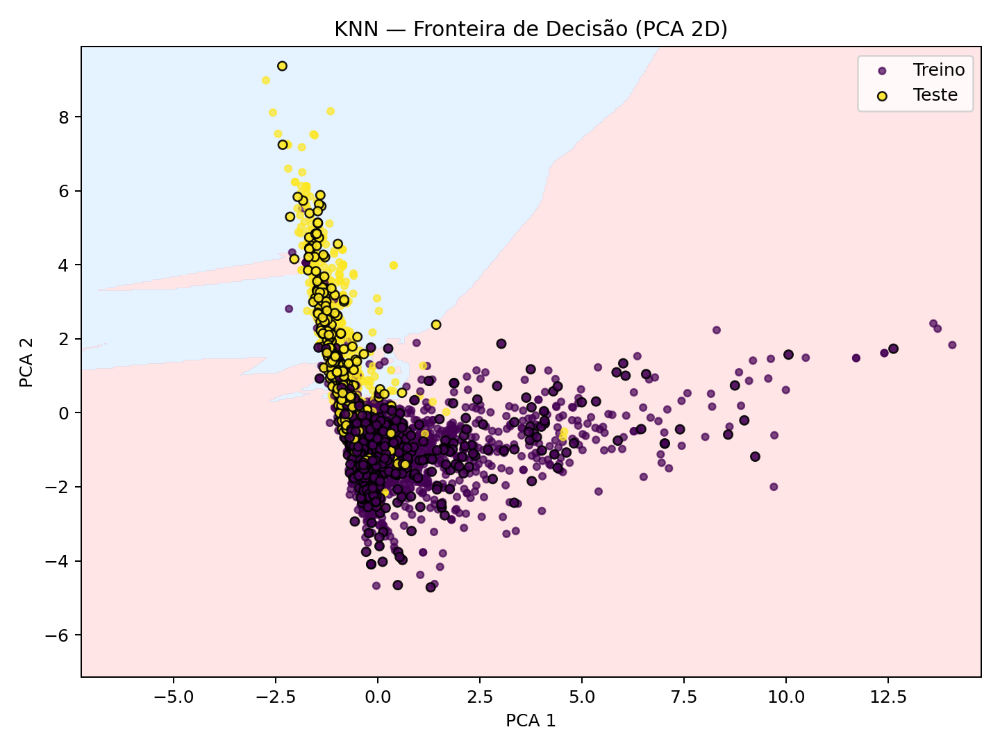

## exploração

O dataset contém 4601 observações, no qual cada linha representa um email, descrito por 58 atributos. Desses, 57 são características extraídas do texto (frequência de palavras, caracteres especiais, uso de maiúsculas, etc.) e 1 é a variável alvo (is_spam), indicando se o email é spam (1) ou não-spam (0).

Assim como na etapa da árvore de decisão, foi realizada uma análise exploratória para compreender melhor o comportamento das classes e identificar os atributos mais relevantes.

## Dispersão por classe

O gráfico de dispersão foi construído utilizando a frequência do caractere ! e a palavra “free”, ambos comuns em spams.
Percebe-se que os emails classificados como spam (X vermelho) tendem a concentrar maiores valores dessas variáveis, enquanto os não-spam (círculos azuis) aparecem em menor intensidade.

Dos 921 emails no conjunto de teste, 836 foram classificados corretamente.

A classe Não-Spam obteve precisão de 92% e recall de 93%.

A classe Spam apresentou precisão de 89% e recall de 88%, ou seja, teve um pouco mais de dificuldade em identificar spams corretamente, mas ainda com bom desempenho.

Esses números indicam que o modelo tem boa capacidade de generalização, conseguindo capturar padrões importantes para distinguir spam de não-spam.

Foi avaliado o impacto da escolha de k no desempenho.
Valores muito pequenos de k tendem a causar overfitting (alta variabilidade), enquanto valores muito grandes podem suavizar demais as fronteiras de decisão.

O melhor equilíbrio foi observado em torno de k=5, valor adotado para os testes principais.

Esse gráfico mostra a projeção dos dados em duas dimensões (PCA 1 e PCA 2) para permitir a visualização da fronteira de decisão do KNN. As regiões coloridas de fundo indicam onde o modelo classifica como spam ou não-spam, enquanto os pontos representam os exemplos reais do conjunto de treino (roxos) e de teste (amarelos). Observa-se que a maior concentração dos pontos está próxima ao centro, região em que ocorre maior sobreposição entre as classes, o que explica parte dos erros de classificação. Ainda assim, é possível perceber áreas bem delimitadas, mostrando que o modelo consegue capturar padrões úteis mesmo em um espaço reduzido para duas dimensões. Essa visualização ilustra como o KNN define suas fronteiras a partir da proximidade entre os pontos, destacando tanto a eficácia quanto as limitações do método em cenários com dados parcialmente sobrepostos.

## Conclusão

O modelo de KNN aplicado ao dataset Spambase apresentou um desempenho consistente, alcançando cerca de 91% de acurácia nos dados de teste. Esse resultado demonstra que o algoritmo foi capaz de aprender padrões relevantes que diferenciam mensagens legítimas de spams, oferecendo uma solução simples, porém eficiente, para esse tipo de tarefa.

Diferentemente da Árvore de Decisão, que gera regras interpretáveis e permite visualizar a importância de cada variável, o KNN se apoia unicamente na proximidade entre exemplos no espaço de atributos. Essa característica faz com que o modelo seja menos transparente em termos de explicação, mas ao mesmo tempo garante flexibilidade, já que ele pode se adaptar bem a fronteiras de decisão complexas.

A análise exploratória reforçou que atributos como a presença da palavra “free”, o uso de caracteres especiais como “!” e “$”, além da frequência de letras maiúsculas, estão fortemente associados ao spam. Esses sinais refletem práticas comuns em mensagens indesejadas, como apelos visuais e tentativas de chamar a atenção do usuário.

Apesar da boa performance, algumas limitações são inerentes ao KNN. O algoritmo demanda maior custo computacional em bases grandes, pois cada nova predição exige o cálculo da distância em relação a todos os pontos de treinamento. Além disso, seu desempenho é sensível à escolha do parâmetro k e à necessidade de normalização dos dados — aspectos que, se não tratados corretamente, podem reduzir sua eficácia.

De forma geral, o KNN mostrou-se uma alternativa viável e robusta para a classificação de spams no dataset Spambase, com a vantagem de ser um método intuitivo e de fácil implementação. No entanto, para cenários de produção em larga escala, seria interessante compará-lo com algoritmos mais escaláveis e interpretáveis, de modo a equilibrar desempenho, custo e explicabilidade.