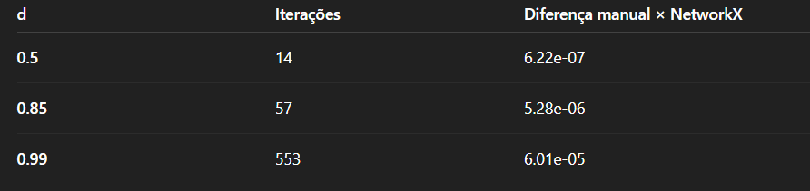

## Exploração dos Dados

Para este projeto foi utilizado o dataset Email-Eu-core, uma rede de comunicações internas de uma instituição europeia.

O dataset contém:

1005 nós, representando funcionários

25.571 arestas direcionadas, representando e-mails enviados de um funcionário para outro

Formato original: Matrix Market (.mtx)

Esse tipo de rede é útil para entender como a informação circula em organizações, identificar hubs de comunicação e analisar padrões de conectividade.

Para compreender melhor os dados antes da aplicação do PageRank, o grafo foi carregado, analisado e preparado para o algoritmo.

## Estrutura do Grafo

O grafo é dirigido, pois cada aresta representa:

funcionário A → funcionário B
(A enviou e-mail para B)

A rede apresenta conectividade densa, com vários funcionários trocando mensagens entre si.

## Implementação do PageRank

O objetivo da atividade foi implementar o PageRank do zero, utilizando a fórmula iterativa tradicional:

	​
Onde:

d = damping factor

N = total de nós

In(i) = nós que apontam para i

L _ j = número de saídas de j

dangling mass = nós sem arestas de saída

Foram testados três valores de d:

0.5

0.85 (valor clássico do algoritmo)

0.99

O PageRank manual foi comparado com o networkx.pagerank como referência.

--8<-- "./Page_rank/pagerank.py"

## Convergência e Validação

A convergência ocorreu com sucesso em todos os testes:

Essas diferenças são extremamente pequenas, confirmando:

- a correção da implementação manual.

- a estabilidade do método iterativo.

- e o comportamento esperado conforme o valor de d aumenta (mais iterações).
## Top 10 Nós Mais Importantes por PageRank

A seguir estão os nós com maior PageRank para cada valor de d.

🔹 d = 0.5 — Distribuição mais homogênea

O algoritmo se comporta de forma mais aleatória, reduzindo a influência da estrutura da rede.

Rank   Nó	PR
1	   161	0.004530
2	   6	0.003520
3	   63	0.003451
4	   87	0.003441
5	   108	0.003202
6	   130	0.003136
7	   122	0.002928
8	   65	0.002922
9	   107	0.002866
10	   22	0.002764

Interpretação:
A importância fica mais distribuída. Não há super-hubs evidentes.

#### d = 0.85 — Cenário padrão do PageRank

Este valor é considerado o mais equilibrado entre navegação aleatória e estrutura da rede.

Rank	Nó	PR
1	    2	 0.009981
2	    131	 0.007297
3	    161	 0.006738
4	    63	 0.005305
5	    87	 0.005114
6	    108	 0.004988
7	    366	 0.004770
8	    122	 0.004705
9	    6	 0.004513
10	    130	 0.004439

Interpretação:
O nó 2 se destaca como o maior hub da organização, seguido por 131 e 161.
Esses indivíduos provavelmente representam funcionários altamente centrais no fluxo de comunicação interno.

#### d = 0.99 — Forte dependência da estrutura

Aqui o teleporte quase não ocorre, e o PageRank concentra a importância nos hubs.

Rank	Nó	PR
1	    2	 0.093084
2	    131	 0.063298
3	    533	 0.037032
4	    228	 0.028223
5	    320	 0.020298
6	    403	 0.016707
7	    684	 0.015458
8	    629	 0.014397
9	    850	 0.011985
10	    384	 0.011115

Interpretação:
Os valores explodem, mostrando forte centralização.
O nó 2 passa de 0.009 → 0.093, quase 10× mais influência.

Isso revela que a rede tem poucos hubs muito conectados que dominam a comunicação.

🧪 Análise do Impacto do Damping Factor
d	Comportamento	Efeito observado
0.5	Caminho muito aleatório	Ranking mais uniforme
0.85	Equilíbrio ideal	Hubs reais da rede aparecem
0.99	Quase sem teleporte	Concentração extrema do PageRank

## Conclusão:

d baixo → o algoritmo se torna mais democrático

d padrão → ressaltam os funcionários realmente importantes

d alto → supervaloriza hubs e aumenta desigualdade no ranking

#### Logo:

O PageRank aplicado ao dataset email-Eu-core permitiu identificar:

Funcionários centrais no fluxo de comunicação.

Padrões de hierarquia informal.

A importância da estrutura da rede na determinação da influência.

A implementação manual demonstrou alta fidelidade ao algoritmo original, com baixíssima diferença em relação ao NetworkX.

O valor d = 0.85 produziu o ranking mais interpretável, enquanto valores extremos de d mostram como o comportamento do “navegador aleatório” influencia o nível de concentração da importância.

Este estudo confirma que o PageRank é uma ferramenta eficaz para análise de redes sociais internas e pode ser usado para identificar hubs de informação, gargalos comunicacionais e potenciais líderes informais dentro de organizações.