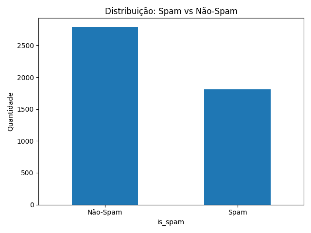
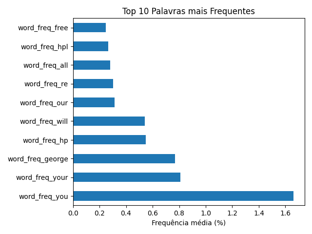
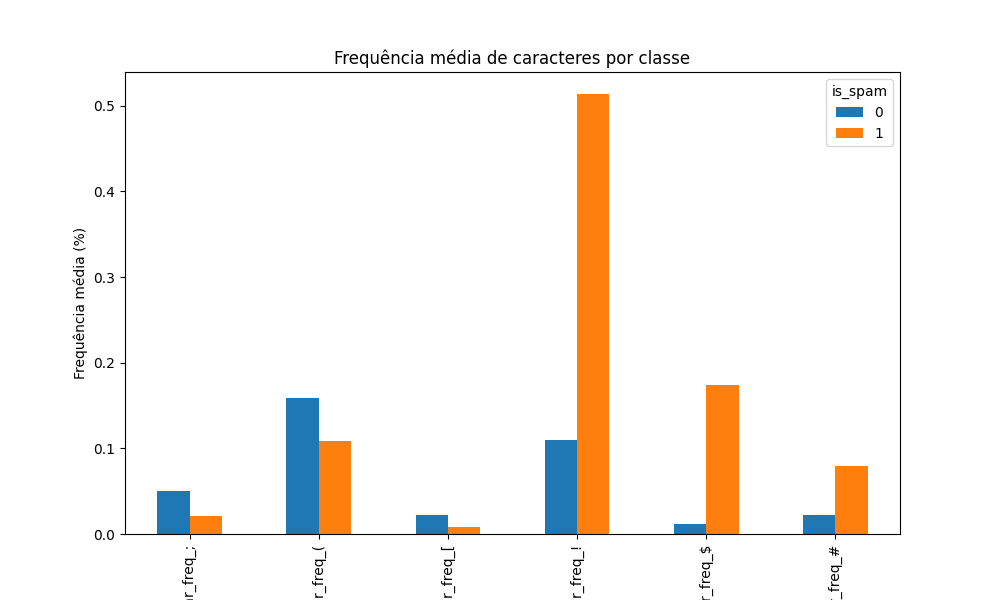
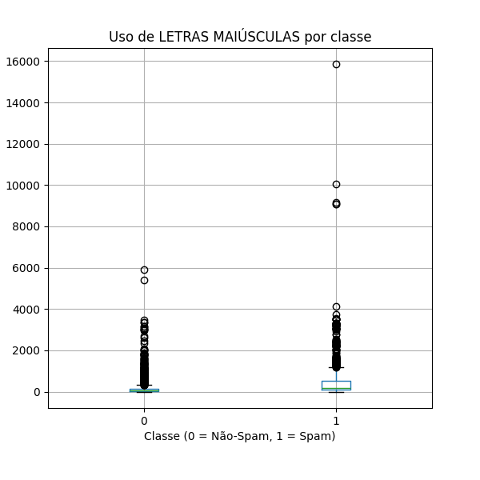
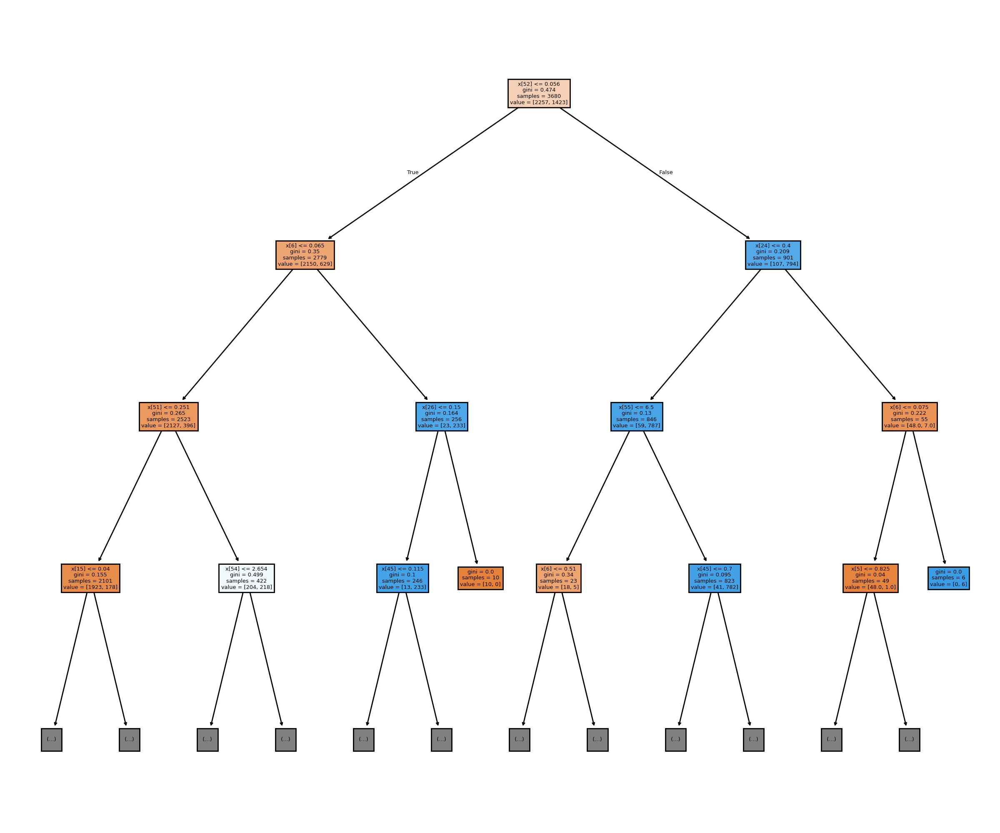

## Exploração dos Dados

Para o projeto foi utilizado o dataset [Spambase](https://archive.ics.uci.edu/dataset/94/spambase)

O dataset utilizado foi o Spambase, Ele contém 4601 observações, no qual são emails e apresenta 58 atributos, sendo 57 características para avaliar se o email é spam ou não e 1 alvo indicando spam ou não-spam. 

Para entendermos melhor os dados que estamos manipulando, foi gerado algumas analises baseado nos dados do projeto.


### Distribuição da Classe


O dataset contém 4601, 2788 emails não-spam e 1813 emails spam.  
Apesar de não ser perfeitamente balanceado, ainda há uma boa representatividade das duas classes.

### Top 10 Palavras mais Frequentes


As palavras mais comuns em emails incluem “you”, “your”, “free” e “our”.  
Palavras utilizadas com frequencia pelas pessoas e que mostra como spams apelam para comunicação direta com o usuário e ofertas atrativas.

Observação: george", "hp", "hpl" aparecem bastante porque o dataset Spambase foi coletado a partir de emails internos da Hewlett-Packard (HP) nos anos 90. Ou seja, são termos de contexto específico.


### Caracteres Especiais por Classe


Emails classificados como spam apresentam maior frequência dos caracteres “!” e “$”, usados para chamar atenção (“OFERTA!!!”, “GANHE $$$”).  
Já os não-spam possuem esses símbolos em quantidade bem menor.


### Uso de Maiúsculas


Os spams tendem a utilizar mais letras maiúsculas ao longo do texto, com picos muito acima dos emails normais.  
Isso reflete a prática de destacar trechos inteiros com maiúsculas para atrair a atenção do leitor.

## Pré-processamento

Antes de treinar o modelo, foi realizada uma etapa de pré-processamento dos dados. Essa fase é fundamental para garantir a qualidade do aprendizado, evitando que inconsistências ou ruídos prejudiquem o desempenho do classificador.

Verificação de valores nulos
Foi utilizado o script exploracao.py para inspecionar o dataset. O teste confirmou que não há valores nulos ou ausentes em nenhuma das 58 colunas, eliminando a necessidade de imputação ou exclusão de registros.

Normalização ou padronização
Não foi necessário aplicar normalização ou padronização das variáveis, pois o algoritmo de Árvore de Decisão não depende de escalonamento. Ele realiza divisões baseadas em valores de corte (thresholds), o que dispensa ajustes na escala das features.

Definição das features e do alvo
As 57 primeiras colunas foram consideradas como variáveis independentes (frequência de palavras, caracteres especiais, uso de maiúsculas, etc.), enquanto a última coluna (is_spam) foi definida como variável alvo, indicando se o email é spam (1) ou não-spam (0).

``` python 
--8<-- "./docs/arvore-decisao/decision-tree.py"
```

## Divisão dos Dados

Para avaliar o desempenho do modelo de forma justa, foi necessário dividir o dataset em dois subconjuntos:

Treinamento (80%) utilizado para o modelo aprender os padrões que diferenciam emails de spam e não-spam.
Teste (20%) utilizado apenas após o treinamento, para verificar a capacidade do modelo de generalizar para dados nunca vistos.

A divisão foi feita com a função train_test_split da biblioteca scikit-learn, fixando random_state=42 para garantir a reprodutibilidade. Isso significa que, mesmo executando o código várias vezes, a mesma separação entre treino e teste será obtida.

from sklearn.model_selection import train_test_split

X_train, X_test, y_train, y_test = train_test_split(
    X, y, test_size=0.2, random_state=42
)

Esse processo é essencial para evitar que o modelo memorize apenas os exemplos disponíveis (overfitting), garantindo que sua avaliação reflita sua real capacidade de identificar corretamente novos emails.

## Treinamento do Modelo

Para a tarefa de classificação, foi escolhida a técnica de Árvore de Decisão, implementada através da classe DecisionTreeClassifier da biblioteca scikit-learn. Esse algoritmo é bastante utilizado em problemas de classificação por ser simples, interpretável e permitir visualizar claramente quais variáveis tiveram maior importância na decisão final.

O modelo foi inicializado com o parâmetro random_state=42, garantindo a reprodutibilidade dos resultados, ou seja, que os mesmos dados de treino e teste levem sempre às mesmas divisões e ao mesmo desempenho.

A etapa de treinamento consistiu em ajustar o modelo (fit) aos dados de treino, fornecendo ao algoritmo 80% das observações do dataset. Nesse processo, a árvore aprende os padrões a partir das variáveis independentes e a relação delas com a variável alvo (is_spam).

Ao final, a árvore de decisão foi capaz de gerar uma estrutura hierárquica de regras que permitem classificar novos emails como spam ou não-spam.

## Avaliação do Modelo

O modelo atingiu 92% de acurácia nos dados de teste.

isso quer dizer que, de cada 100 emails, cerca de 92 foram classificados corretamente.

## Conclusão

## Visualização da Árvore




O modelo de Árvore de Decisão treinado sobre o dataset Spambase apresentou um desempenho consistente, alcançando aproximadamente 92% de acurácia nos testes. Esse resultado indica que o algoritmo conseguiu aprender de forma eficaz os padrões que diferenciam emails de spam e não-spam.

A análise exploratória mostrou que spams costumam utilizar com maior frequência palavras como “you” e “your”, empregam intensivamente caracteres especiais como “!” e “$”, e fazem uso exagerado de maiúsculas para chamar a atenção do leitor. Esses elementos refletem estratégias típicas de mensagens indesejadas.

Por outro lado, termos como “george” e “hp” também se destacaram, revelando um viés do dataset, já que ele foi coletado em um contexto corporativo específico (emails da Hewlett-Packard nos anos 90). Isso reforça a importância de avaliar a origem e a atualidade dos dados ao aplicar modelos em cenários reais.

De modo geral, a Árvore de Decisão demonstrou ser uma técnica eficaz e interpretável para a tarefa de classificação de spam. Mas claro, ainda porderiamos utilizar mais ferramentas para aprimorar a árvore.